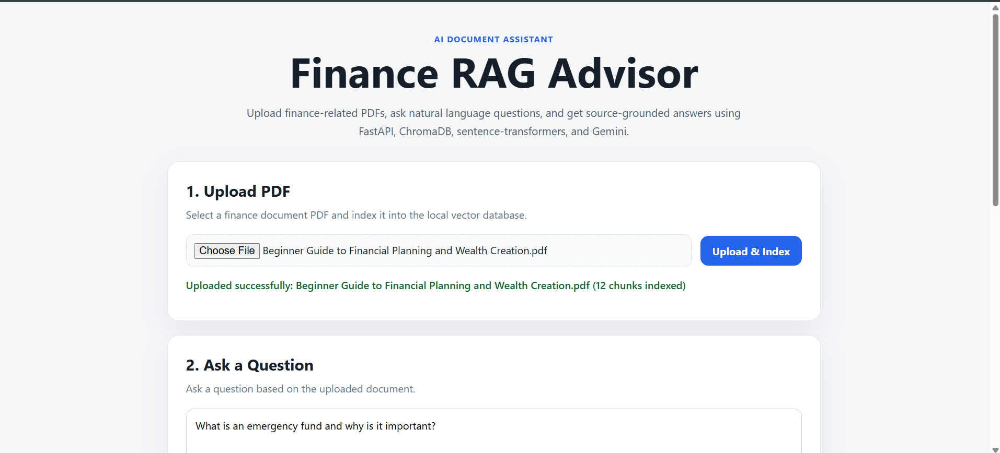
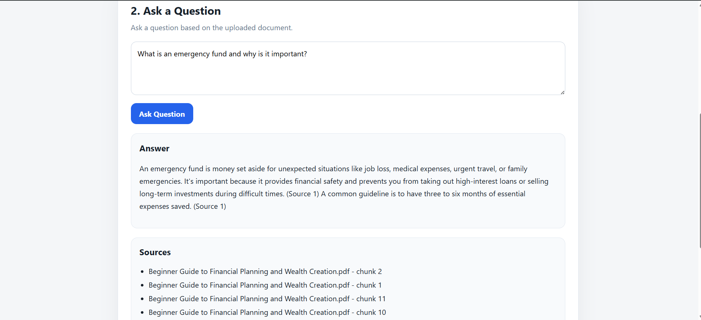
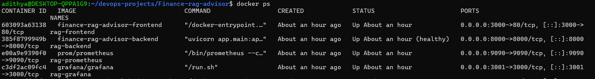
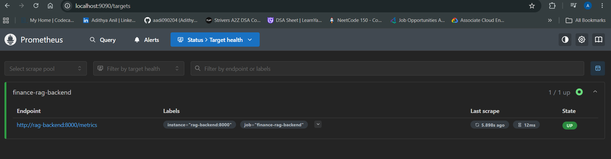
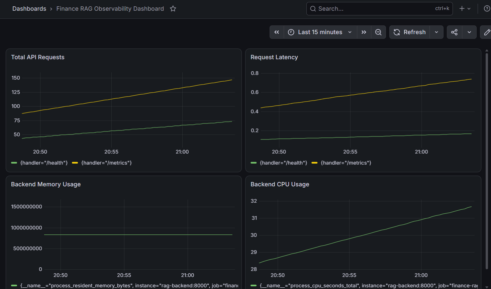
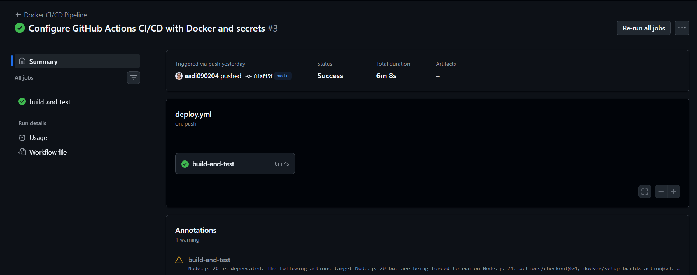

# 🚀 Finance RAG Advisor
### Production-Inspired Retrieval-Augmented Generation (RAG) Financial Assistant with FastAPI, React, ChromaDB, Gemini, Docker, Prometheus, Grafana and GitHub Actions CI/CD

<div align="center">


</div>

---

# 📌 Overview

Finance RAG Advisor is a Retrieval-Augmented Generation (RAG) application that enables users to upload financial PDF documents, perform semantic retrieval using vector embeddings, and generate source-grounded responses using Google's Gemini models.

The project was designed to explore how modern AI applications are engineered, containerized, monitored, and automated using production-inspired software engineering and DevOps practices.

This project combines:

- Artificial Intelligence Engineering
- Retrieval-Augmented Generation (RAG)
- Vector Databases
- Backend Engineering
- Frontend Development
- Containerization
- CI/CD Automation
- Monitoring and Observability
- Cloud-Native Design Principles

---

# 🎯 Why I Built This

I built this project to understand how modern AI systems move beyond simple prompts and become deployable, observable, and maintainable software systems.

The primary goals were:

- Build a practical Retrieval-Augmented Generation system
- Learn semantic search and vector databases
- Work with LLM orchestration pipelines
- Containerize multi-service applications
- Implement CI/CD automation
- Explore monitoring and observability
- Understand production-style service architecture
- Practice debugging distributed systems

---

# ✨ Features

## AI Features

✅ Upload financial PDF documents

✅ Extract PDF content using pypdf

✅ Intelligent text chunking

✅ Generate embeddings using Sentence Transformers

✅ Store embeddings in ChromaDB

✅ Perform semantic similarity search

✅ Generate source-grounded answers using Gemini

✅ Retrieval-only fallback mode when Gemini is unavailable

✅ Display source chunks used for answer generation

---

## DevOps Features

✅ Dockerized frontend and backend

✅ Docker Compose orchestration

✅ GitHub Actions CI pipeline

✅ Health checks

✅ Container restart policies

✅ Environment-based configuration

✅ Prometheus monitoring

✅ Grafana dashboards

✅ FastAPI instrumentation

✅ Service observability

---

# ☁️ Cloud-Native Design Principles

Although this project currently runs locally using Docker Compose, it follows several cloud-native design patterns:

| Principle | Implementation |
|---|---|
| Containerization | Docker |
| Service Separation | React + FastAPI |
| Environment Configuration | .env |
| Infrastructure Automation | Docker Compose |
| API-first Design | FastAPI |
| CI/CD | GitHub Actions |
| Health Checks | /health |
| Monitoring | Prometheus |
| Observability | Grafana |
| Persistent Storage | ChromaDB |

The architecture can be extended for deployment to:

- Kubernetes
- AWS ECS
- AWS EKS
- Google Kubernetes Engine
- Azure Container Apps
- Google Cloud Run

---

# 🏗 System Architecture

```text
                    GitHub Repository
                            │
                            ▼
                    GitHub Actions CI
                            │
                            ▼
                     Docker Build
                            │
                            ▼
                    Docker Compose
                            │
         ┌──────────────────┴──────────────────┐
         ▼                                     ▼
    React Frontend                      FastAPI Backend
                                                 │
                                                 ▼
                                          RAG Pipeline
                                                 │
                    ┌────────────────────────────┴──────────────────────┐
                    ▼                                                   ▼
             ChromaDB                                         Gemini API
                    │
                    ▼
          Sentence Transformers
                    │
                    ▼
             Vector Embeddings
```

---

# 🧠 Retrieval-Augmented Generation Pipeline

```text
PDF Upload
     │
     ▼
PDF Extraction
     │
     ▼
Text Chunking
     │
     ▼
Embedding Generation
     │
     ▼
ChromaDB Storage
     │
     ▼
Semantic Retrieval
     │
     ▼
Prompt Construction
     │
     ▼
Gemini Generation
     │
     ▼
Source Grounded Response
```

---

# 📊 Monitoring Architecture

```text
FastAPI Application
        │
        ▼
Prometheus Instrumentator
        │
        ▼
/metrics endpoint
        │
        ▼
Prometheus Server
        │
        ▼
Grafana Dashboard
```

Metrics collected include:

- API request count
- Request latency
- Endpoint response times
- CPU utilization
- Memory consumption
- Service health status

---

# ⚙️ Technology Stack

| Category | Technology |
|---|---|
| Frontend | React, Vite |
| Backend | FastAPI, Uvicorn |
| AI Model | Gemini |
| Embeddings | Sentence Transformers |
| Vector Database | ChromaDB |
| PDF Processing | pypdf |
| Monitoring | Prometheus |
| Observability | Grafana |
| Containerization | Docker |
| Orchestration | Docker Compose |
| CI/CD | GitHub Actions |
| Environment Management | python-dotenv |
| Languages | Python, JavaScript |

---

# 📁 Project Structure

```text
Finance-rag-advisor/

├── .github/
│   └── workflows/
│       └── ci.yml
│
├── backend/
│   ├── app/
│   │   ├── main.py
│   │   ├── config.py
│   │   ├── rag_pipeline.py
│   │   ├── vector_store.py
│   │   ├── pdf_loader.py
│   │   ├── text_splitter.py
│   │   └── schemas.py
│   │
│   ├── Dockerfile
│   └── requirements.txt
│
├── frontend/
│   ├── src/
│   └── Dockerfile
│
├── monitoring/
│   ├── prometheus.yml
│   └── grafana/
│
├── screenshots/
│
├── docker-compose.yml
└── README.md
```

---

# 📸 Project Demonstration

## Upload Financial Documents



---

## Source Grounded Answer Generation



---

## Semantic Search


---

## Dockerized Services



---

## Prometheus Monitoring



---

## Grafana Dashboard



---

## GitHub Actions CI



---

# 🐳 Running Locally

Clone repository:

```bash
git clone https://github.com/aadi090204/Finance-rag-advisor.git

cd Finance-rag-advisor
```

Create environment file:

```bash
cp .env.example .env
```

Add:

```env
GEMINI_API_KEY=YOUR_API_KEY
```

Build containers:

```bash
docker compose build
```

Start services:

```bash
docker compose up -d
```

---

# 🌐 Application URLs

Frontend:

```text
http://localhost:3000
```

Backend:

```text
http://localhost:8000
```

Swagger:

```text
http://localhost:8000/docs
```

Prometheus:

```text
http://localhost:9090
```

Grafana:

```text
http://localhost:3001
```

Metrics:

```text
http://localhost:8000/metrics
```

---

# 🔌 API Endpoints

| Method | Endpoint |
|---|---|
| GET | /health |
| GET | /metrics |
| POST | /upload |
| POST | /ask |
| DELETE | /documents/reset |

---

# 🔄 GitHub Actions CI Pipeline

The GitHub Actions pipeline automatically:

- Checks out source code
- Builds backend Docker image
- Builds frontend Docker image
- Validates Docker Compose
- Performs container startup checks
- Executes health validation
- Detects build failures early

---

# 🔧 Engineering Challenges Solved

During development, several production-style issues were encountered and resolved:

- Fixed UTF-16 encoded requirements.txt breaking Docker builds
- Debugged unhealthy container health checks
- Resolved long startup times caused by Sentence Transformer initialization
- Implemented Prometheus FastAPI instrumentation
- Configured Prometheus scraping
- Built Grafana monitoring dashboards
- Debugged Docker volume mounting issues
- Implemented fallback retrieval mode when Gemini API is unavailable
- Optimized container startup behavior

---

# 📚 Key Learnings

This project helped me learn:

- Retrieval-Augmented Generation
- Vector databases
- Semantic search
- Prompt engineering
- FastAPI development
- React integration
- Docker containerization
- Docker Compose orchestration
- GitHub Actions CI/CD
- Prometheus monitoring
- Grafana observability
- Service health monitoring
- Production debugging
- Cloud-native application design

---

# 🚀 Future Improvements

- Kubernetes deployment
- Redis caching
- JWT authentication
- Multi-document retrieval
- OpenTelemetry tracing
- Automated testing pipeline
- CI/CD deployment automation
- Horizontal scaling
- Object storage integration

---

# 👨‍💻 Author

## Adithya Anil

Software Engineer | AI Engineer | DevOps Engineer | Cloud-Native Enthusiast

GitHub:

https://github.com/aadi090204
